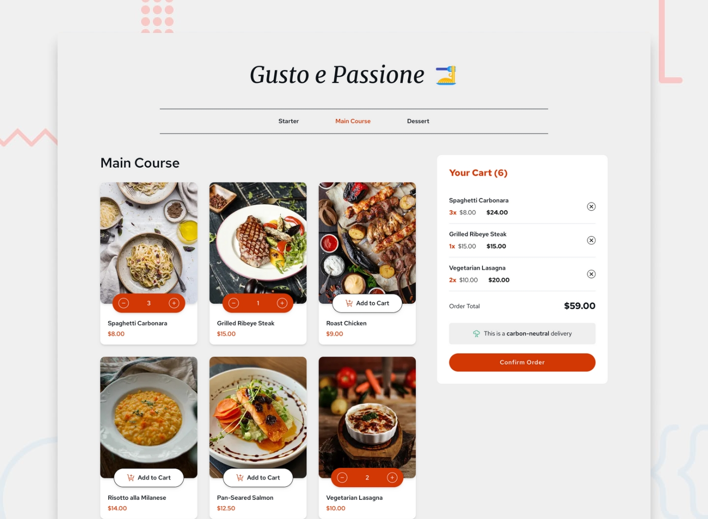

# Frontend Mentor - Product list with cart

## Welcome! 👋

This is a solution to the [Product list with cart challenge on Frontend Mentor](https://www.frontendmentor.io/challenges/product-list-with-cart-5MmqLVAp_d).
I've added new categories inspired by a fictional Italian restaurant, where users can order Starters, Main Courses, or Desserts.

## The challenge

Users are able to:

- Select meal categories (Starters, Main Courses, Desserts)
- Add items to the cart and remove them
- Increase/decrease the number of items in the cart
- See an order confirmation modal when they click "Confirm Order"
- Reset their selections when they click "Start New Order"
- View the optimal layout for the interface depending on their device's screen size
- See hover and focus states for all interactive elements on the page

## Built with

- JS library - [React](https://reactjs.org/)
- Tailwind CSS - [Tailwind](https://tailwindcss.com/)
- Deployment Tool - [Next.js](https://nextjs.org/)

## Author

- Website - [Cyril Leblanc](https://portfolio-cyrileblanc.netlify.app/)
- Frontend Mentor - [@Cyrilebl](https://www.frontendmentor.io/profile/Cyrilebl)
